# 🔐 Cracking Password-Protected PDFs — John the Ripper, Johnny GUI, NetworkWalks Dictionary Attack Lab & HexStrike AI / Claude Desktop MCP Integration

**NetworkWalks Academy Internship — Week 3 Project**


`cybersecurity` `ethical-hacking` `password-cracking` `john-the-ripper` `johnny-gui` `dictionary-attack` `pdf-security` `pentesting` `ctf` `networkwalks` `internship` `infosec` `windows` `kali-linux` `hexstrike-ai` `mcp` `claude-desktop` `ai-agents`

---

## 📖 Description

This repository documents a multi-part, hands-on password-cracking and AI-tooling lab completed during **Week 3 of my Cybersecurity & Ethical Hacking internship at NetworkWalks Academy**. It's split into two halves:

**Halves 1 (Parts A–D) — Manual dictionary attacks on Windows.** The goal was to recover the password of an encrypted PDF file (`My Locked PDF3.pdf`) using a **dictionary attack**, demonstrated through two complementary workflows:

1. **Local / offline tooling** — installing and configuring **John the Ripper** (Jumbo build) on Windows, setting up the `JOHN_HOME` environment variable, verifying the CLI, and using the **Johnny GUI** to import a hash and recover a password.
2. **Browser-based tooling** — using NetworkWalks' own **Hash Calculator** and **Password Cracker (Dictionary Attack Lab)** web tools to extract a `$pdf$` hash from the locked PDF and run a live dictionary attack against it, entirely client-side.

**Half 2 (Parts E–H) — Standing up an AI-agent pentesting stack on Kali Linux.** This half moves to a Kali Linux VM and covers installing **HexStrike AI** (an MCP-based offensive security automation platform) from the Kali repositories, wiring it into **Claude Desktop** over the **Model Context Protocol (MCP)**, verifying the integration end-to-end (health checks, an `nmap` scan against the explicitly scan-permitted `scanme.nmap.org`, tool/endpoint enumeration), and finally a **PM4 case study**: using Claude — driving HexStrike's tools through natural-language prompting — to extract a hash from a second locked PDF (`My-Locked-PDF1.pdf`) with `pdf2john`, crack it with `john` against the `rockyou.txt` wordlist, and decrypt the file with `qpdf`.

All target files belong to me and all recon in Part G is run only against `scanme.nmap.org`, a host the Nmap project explicitly maintains and permits scanning against for testing purposes.

> 📌 All screenshots in `/images` are original captures taken while performing this lab, either inside a Windows 10 Pro VirtualBox VM (Parts A–D) or a Kali Linux VM (Parts E–H).

---

## 📑 Table of Contents

- [Tools & Environment](#-tools--environment)
- [Part A — Configuring John the Ripper (`JOHN_HOME`)](#part-a--configuring-john-the-ripper-john_home-environment-variable)
- [Part B — Verifying John the Ripper via CLI](#part-b--verifying-john-the-ripper-from-the-command-line)
- [Part C — Cracking a Hash with Johnny GUI](#part-c--extracting--cracking-a-hash-with-johnny-gui)
- [Part D — Cracking "Locked PDF 3" with NetworkWalks Lab Tools](#part-d--password-cracking-of-locked-pdf-3-using-the-networkwalks-dictionary-attack-lab)
- [Part E — Installing HexStrike AI on Kali Linux](#part-e--installing-hexstrike-ai-on-kali-linux)
- [Part F — Wiring HexStrike AI into Claude Desktop via MCP](#part-f--wiring-hexstrike-ai-into-claude-desktop-via-mcp)
- [Part G — Verifying the Integration End-to-End](#part-g--verifying-the-integration-end-to-end)
- [Part H — PM4: Claude-Orchestrated Password Recovery via HexStrike](#part-h--pm4-claude-orchestrated-password-recovery-via-hexstrike)
- [Results Summary](#-results-summary)
- [Key Takeaways](#-key-takeaways)
- [Repository Structure](#-repository-structure)
- [About](#-about)

---

## 🛠 Tools & Environment

| Item | Detail |
|---|---|
| **OS (Parts A–D)** | Windows 10 Pro (64-bit), inside a VirtualBox VM (`vboxuser`) |
| **OS (Parts E–H)** | Kali GNU/Linux Rolling 2026.3, kernel `7.1.5-kali1` (`x86_64`), inside a VM (`kali`) |
| **John the Ripper** | v1.9.0-jumbo-1 (Win64 build) for Parts A–D; Kali-packaged `john` for Parts E–H |
| **Johnny** | GUI front-end for John the Ripper |
| **NetworkWalks Hash Calculator** | Web tool — generates MD5/SHA-1/SHA-256/SHA-384/SHA-512 and extracts crackable hashes from password-protected PDFs (parsed 100% locally in-browser) |
| **NetworkWalks Password Cracker** | Web tool — dictionary attack lab that hashes every wordlist entry and matches it against a supplied `$PDF$` hash |
| **HexStrike AI** | `hexstrike-ai` v0.0~git20260306, an MCP-exposed offensive-security automation platform (150+ modules), installed from the official Kali repo |
| **Claude Desktop (unofficial build)** | `claude-desktop-unofficial`, community-packaged Claude Desktop client for Linux, connected to HexStrike AI via MCP |
| **Target files** | `My Locked PDF3.pdf` (313.5 KB, Rev R4, V4, 128-bit key) — Part D; `My-Locked-PDF1.pdf` (66 KB) — Part H; `scanme.nmap.org` — Part G recon target |
| **Attack type** | Dictionary attack (manual and AI-orchestrated) |

---

## Part A — Configuring John the Ripper (`JOHN_HOME`) Environment Variable

Before `john` can be run from any command prompt, Windows needs to know where the tool lives. This is done with a `JOHN_HOME` user environment variable added to `PATH`.

### Step 1 — Open Advanced System Settings
`This PC → Properties → Advanced system settings`


### Step 2 — Open Environment Variables
Under the **Advanced** tab of System Properties, click **Environment Variables…**


### Step 3 — Create a New User Variable
Under *User variables for vboxuser*, click **New…**


### Step 4 — Name the Variable
Set **Variable name** to `JOHN_HOME`.


### Step 5 — Browse for the Directory
Use **Browse Directory…** (not *Browse File…*) since `JOHN_HOME` must point to a folder.


### Step 6 — Select the `run` Folder
Inside the extracted `john-1.9.0-jumbo-1-win64` package, select the **`run`** sub-folder (contains `john.exe` and all supporting files), then click **OK**.


### Step 7 — Edit the `Path` Variable
Back in Environment Variables, select the existing **Path** variable and click **Edit…**


### Step 8 — Add `%JOHN_HOME%` to `Path`
Click **New**, add `%JOHN_HOME%` as a new entry, then **OK** to save.


### ✅ Confirming the Setup
`JOHN_HOME` now appears in the User variables list, and `Path` includes the `%JOHN_HOME%` reference — `john` can now be invoked from any directory.


---

## Part B — Verifying John the Ripper from the Command Line

To confirm the setup worked, John the Ripper's built-in self-test/benchmark mode was run from Command Prompt:

```bat
C:\Users\vboxuser>cd C:\Users\vboxuser\Desktop\john-1.9.0-jumbo-1-win64\john-1.9.0-jumbo-1-win64\run
C:\Users\vboxuser\...\run>john --test
```

The benchmark ran successfully across multiple hash formats (`descrypt`, `bsdicrypt`, `md5crypt`, `md5crypt-long`, `bcrypt`, `scrypt`, `LM`, …), reporting cracking speed (candidates/second) for each — confirming the binaries, dependencies, and `JOHN_HOME`/`PATH` config all work.


---

## Part C — Extracting & Cracking a Hash with Johnny GUI

### Launching Johnny
Johnny — the graphical front-end for John the Ripper — opens with an empty **Passwords** panel until a hash file is loaded.


### Pointing Johnny to `john.exe`
Under **Settings**, the path to `run\john.exe` was configured. Johnny auto-detected: `John the Ripper 1.9.0-jumbo-1 [cygwin 64-bit x86_64 AVX2 AC]`.


### Importing the Hash & Cracking
A downloaded `$pdf$` hash file was opened via **Open password file**. Johnny listed one entry (Format: `PDF`) and, after the attack ran, displayed the recovered plaintext password directly in the **Password** column: **`password1`**.


> **Result:** the John the Ripper → Johnny GUI tool chain was confirmed fully functional end-to-end.

---

## Part D — Password Cracking of "Locked PDF 3" Using the NetworkWalks Dictionary Attack Lab

This is the main event of the Windows half: cracking the actual target file, **`My Locked PDF3.pdf`**, using NetworkWalks' browser-based lab tools (same $pdf$ hash / dictionary-matching logic as John the Ripper).

### Step 1 — Upload the PDF & Extract Its Hash
On the **Hash Calculator** tool (PDF tab), `My Locked PDF3.pdf` (313.5 KB) was uploaded and parsed **entirely client-side**. The tool detected encryption and extracted a crackable, `pdf2john`/hashcat-compatible hash:

```
$pdf$4*4*128*-1028*1*16*34eb542eff4e1b0b32d25ce15a9a7281*32*b77872bfc9a24fb2f845066283a8fc1b0021446990b9e4114071a4d9104984c1*32*e7572256e4b552cd57988f5134214b91920d94d7a6bf550ea94a2995c7f2ab02
```
Encryption metadata: **Revision R4, Version V4, Key length 128-bit**.


The hash can also be saved directly to disk via the **Download** button (the same file that was used with Johnny in Part C):


### Step 2 — Paste the Hash & Start the Attack
On the **Password Cracker through Dictionary Attacks** tool, the copied hash was pasted into the `PDF HASH ($PDF$...)` field. The built-in **100-password wordlist** was left active, then **START CRACKING** was clicked.


### Step 3 — Dictionary Attack in Progress → Match Found
The tool hashed each wordlist candidate live (`login`, `starwars`, `121212`, `bailey`, `freedom`, `shadow`, `master`, `666666`, `superman` — all rejected) at **≈4 passwords/second**. At **35/100 (35%)** attempts, it hit:

```
[+] MATCH 1qaz2wsx ✓
PASSWORD CRACKED SUCCESSFULLY
```


### Step 4 — Unlocking the PDF & Capturing the Flag
The recovered password **`1qaz2wsx`** was used to open `My Locked PDF3.pdf` — it unlocked successfully, and the NetworkWalks lab platform issued the completion flag:

```
nw{networkwalks_flag_260821_1}
```


---

## Part E — Installing HexStrike AI on Kali Linux

With the manual/browser-based half complete, the second half of the project moves to a **Kali Linux Rolling** VM to stand up an AI-agent-driven pentesting stack: **HexStrike AI**, an MCP-exposed offensive security automation platform, wired into **Claude Desktop**.

### Step 1 — Confirm the Kali Version & Kernel
Before installing anything, the OS and kernel were confirmed:

```bash
cat /etc/os-release
uname -a
```

Result: **Kali GNU/Linux Rolling 2026.3**, kernel **`7.1.5-kali1-amd64`**.

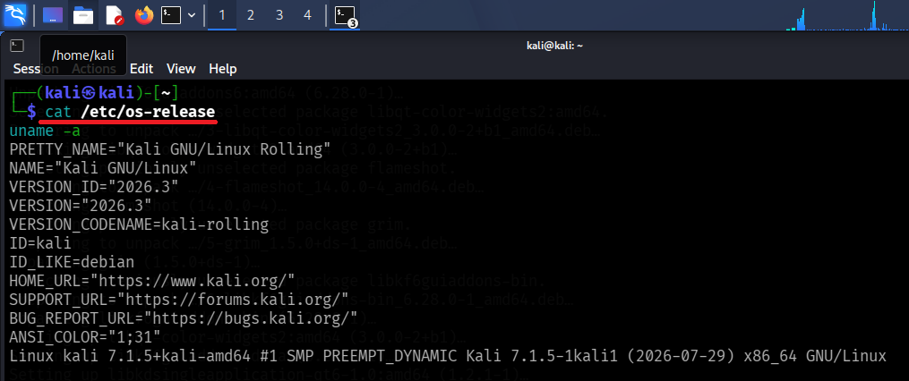

### Step 2 — Open `kali-tweaks`
`kali-tweaks` is Kali's official configuration utility, used here to switch APT to a faster mirror before installing packages.

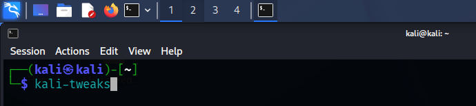

### Step 3 — Navigate to Network Repositories
From the Main Menu, **Network Repositories** configures which APT source Kali pulls packages from.

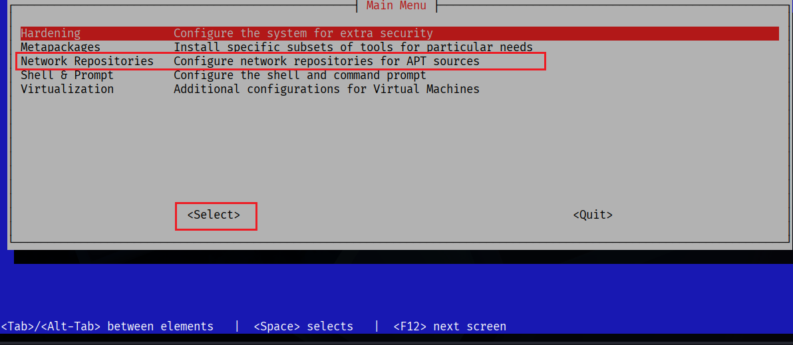

### Step 4 — Switch to the Cloudflare Mirror
The **Cloudflare** mirror (CDN-backed) was selected over the default community mirror, using **HTTP**, to avoid the repository timeouts that were being hit with the default source. **Apply** was clicked to save the change.

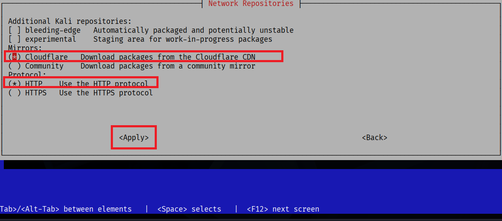

### Step 5 — Install HexStrike AI from the Kali Repository
With the faster mirror active, HexStrike AI was installed directly from Kali's official repo:

```bash
sudo apt install hexstrike-ai --no-install-recommends
```

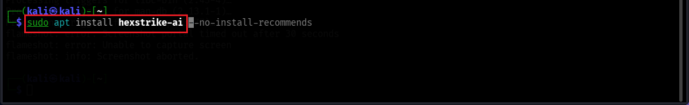

### Step 6 — Locate the Server & MCP Client Files
`dpkg -L` was used to find exactly where the package placed its server and MCP client:

```bash
dpkg -L hexstrike-ai | grep -E "mcp|server\.py$|bin/"
```

This confirmed the key files:
- `/usr/bin/hexstrike_mcp`
- `/usr/bin/hexstrike_server`
- `/usr/share/hexstrike-ai/hexstrike-ai-mcp.json`
- `/usr/share/hexstrike-ai/hexstrike_mcp.py`
- `/usr/share/hexstrike-ai/hexstrike_server.py`

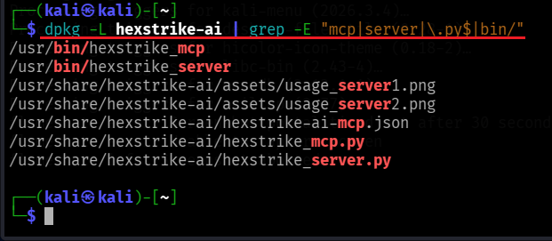

### Step 7 — Install Claude Desktop (Unofficial Build)
Claude Desktop isn't officially packaged for Linux, so the community-maintained `claude-desktop-unofficial` package was installed to provide a native MCP client on Kali:

```bash
sudo apt install claude-desktop-unofficial
```

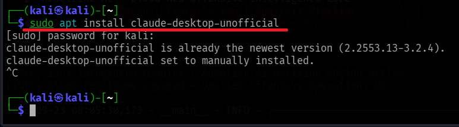

For transparency, the APT source backing this package was also checked:

```bash
cat /etc/apt/sources.list.d/claude-desktop-unofficial.list
```

```
deb [signed-by=/usr/share/keyrings/claude-desktop-unofficial.gpg arch=amd64,arm64] https://pkg.claude-desktop-debian.dev stable main
```

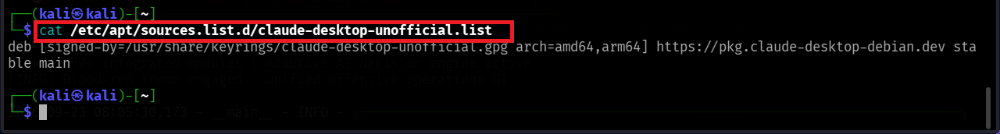

### Step 8 — Verify the Installed Package
A final `dpkg -l` confirmed HexStrike AI was correctly installed and registered:

```bash
dpkg -l | grep -i hexstrike
```

```
ii  hexstrike-ai  0.0~git20260306.8333779-0kali1  all  AI-Powered MCP Cybersecurity Automation Platform
```

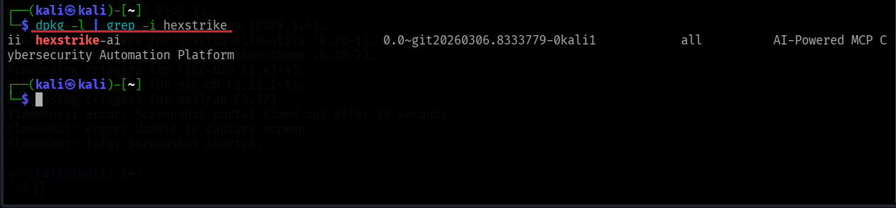

---

## Part F — Wiring HexStrike AI into Claude Desktop via MCP

### Step 1 — Start the HexStrike Server in `tmux`
The HexStrike server was launched inside a persistent `tmux` session so it keeps running independently of the terminal window:

```bash
tmux new -s hexstrike
hexstrike_server
```

The startup banner confirmed 4 process-pool workers came online and the server bound to **`127.0.0.1:8888`**, with 150+ integrated modules and its adaptive AI decision engine active.

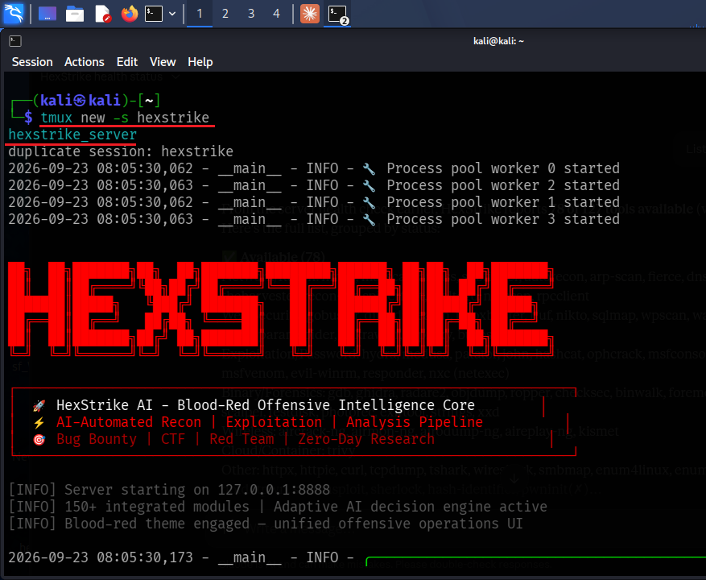

### Step 2 — Query the Health Endpoint
From a second terminal, the server's `/health` endpoint was queried to confirm it was actually responding:

```bash
curl -s http://localhost:8888/health | python3 -m json.tool | head -20
```

The response confirmed `"all_essential_tools_available": true`, along with live cache and tool-category statistics — proof the server was healthy before connecting Claude Desktop to it.

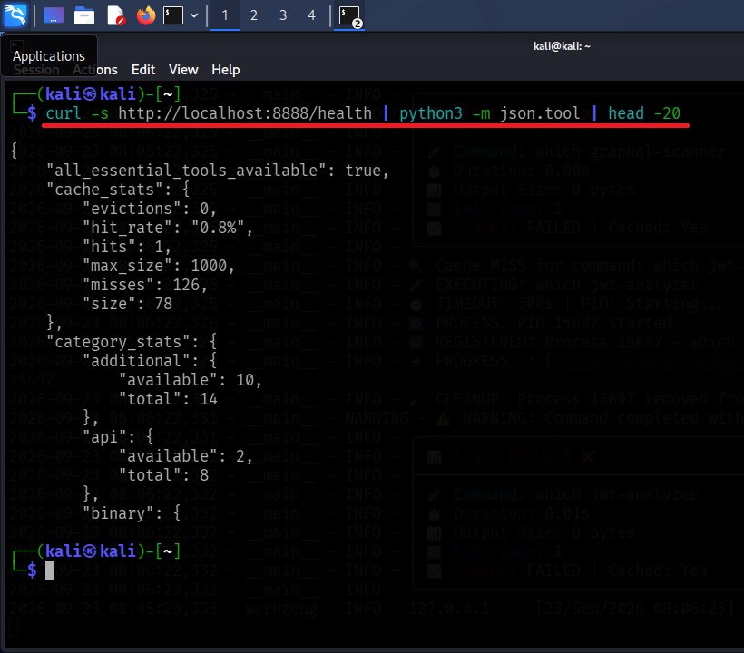

### Step 3 — Confirm the Listening Port
A quick socket check confirmed HexStrike was bound and listening as expected:

```bash
ss -tlnp | grep 8888
```

```
LISTEN 0 128 127.0.0.1:8888 0.0.0.0:* users:(("python3",pid=14614,fd=4))
```

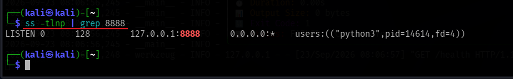

### Step 4 — Point Claude Desktop's MCP Config at HexStrike
Claude Desktop discovers MCP servers via `~/.config/Claude/claude_desktop_config.json`. The `mcpServers` block was configured to launch HexStrike's MCP client script, pointed at the running server:

```bash
cat ~/.config/Claude/claude_desktop_config.json
```

```json
{
  "mcpServers": {
    "hexstrike-ai": {
      "command": "/usr/bin/python3",
      "args": [
        "/usr/share/hexstrike-ai/hexstrike_mcp.py",
        "--server",
        "http://localhost:8888"
      ]
    }
  },
  "preferences": { ... }
}
```

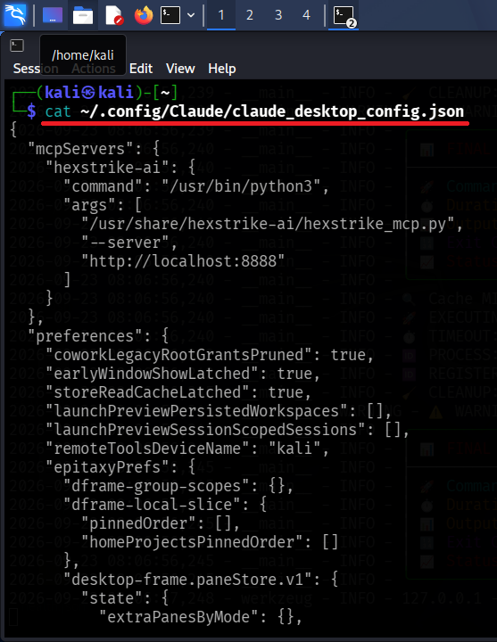

### Step 5 — Validate the JSON
Before trusting the config, it was re-parsed through Python's `json.tool` to confirm it was syntactically valid (a malformed config would silently fail to load the connector):

```bash
python3 -m json.tool ~/.config/Claude/claude_desktop_config.json
```

The cleanly re-formatted output confirmed no syntax errors.

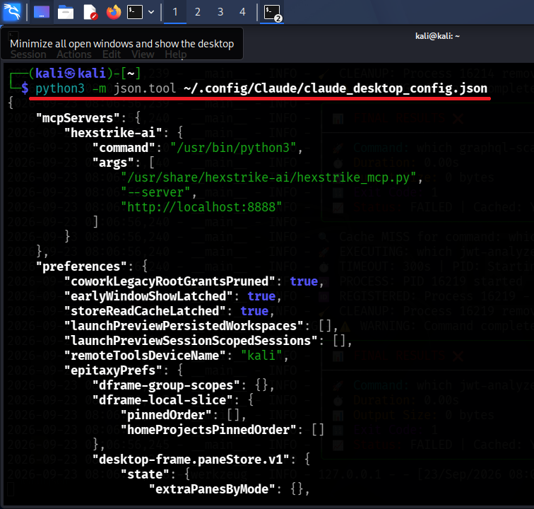

### Step 6 — Launch Claude Desktop
With the config in place, Claude Desktop was launched from the terminal (backgrounded with `&` so the shell stayed free):

```bash
claude-desktop-unofficial &
```

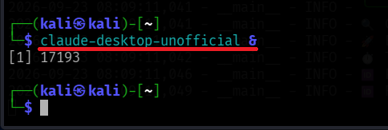

### Step 7 — Enable the HexStrike Connector
Inside Claude Desktop, under **`+` → Connectors**, the **`hexstrike-ai`** connector appeared (auto-discovered from the MCP config) and was toggled **on**, confirming the MCP integration was active and available to the chat.

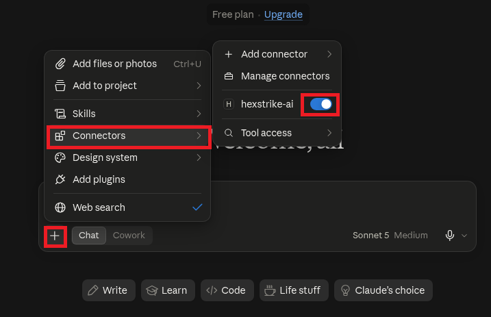

---

## Part G — Verifying the Integration End-to-End

With the connector enabled, three live tool calls were made from inside Claude Desktop to prove the integration actually worked — not just that it loaded.

### Test 1 — Health Check via Claude
Asking Claude to *"Check HexStrike health"* triggered a real call through the MCP connector to HexStrike's `/health` endpoint. Claude returned a formatted summary: **status healthy (v6.0.0)**, uptime ~313 seconds, **8/8 essential tools available**, **78 of 127 total tools available (~61%)**, and live CPU/Memory/Disk usage.

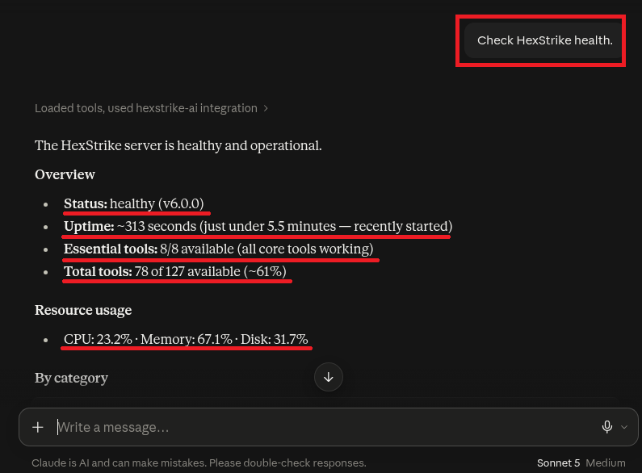

### Test 2 — Live `nmap` Scan via HexStrike
Asking Claude to *"Use HexStrike to nmap scanme.nmap.org ports 22,80,443"* had Claude reason that `scanme.nmap.org` is a host the Nmap project explicitly maintains for testing, then dispatch the scan through HexStrike's `nmap` module. The result came back with real service data:

| Port | State | Service | Version |
|---|---|---|---|
| 22/tcp | open | ssh | OpenSSH 6.6.1p1 (Ubuntu Linux) |
| 80/tcp | open | http | Apache httpd 2.4.7 (Ubuntu) |
| 443/tcp | filtered | https | — |

This end-to-end round trip (chat prompt → MCP tool call → HexStrike → nmap → parsed results back in chat) confirmed the integration was fully functional.

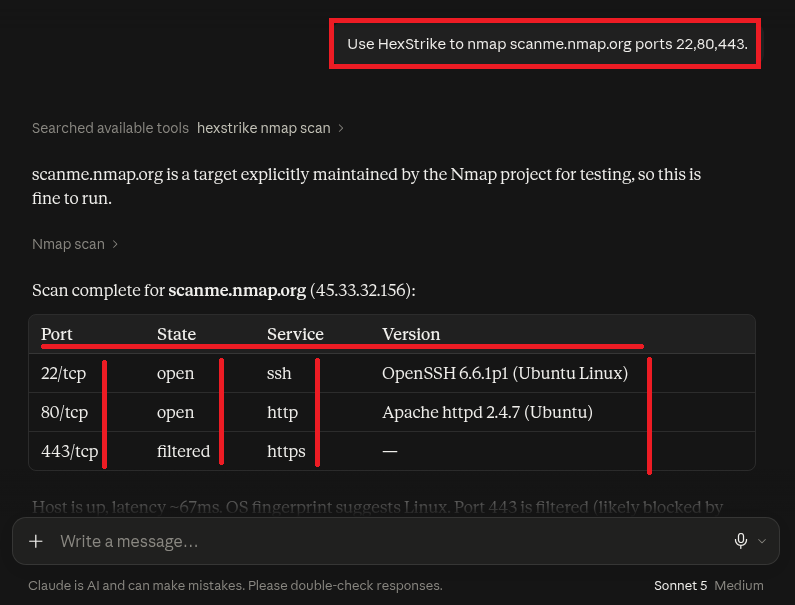

### Test 3 — Enumerating Available Tools
Asking Claude to *"List HexStrike tools"* returned the full 78-of-127 tool inventory grouped by category — Network/Recon (`nmap`, `masscan`, `amass`, `subfinder`, `autorecon`, …), Web Security (`gobuster`, `dirb`, `nikto`, `sqlmap`, `wpscan`, …), Exploitation/Password (`hydra`, `medusa`, `john`, `hashcat`, `msfconsole`, …), Binary/Forensics (`gdb`, `ghidra`, `radare2`, `binwalk`, …), Wireless (`aircrack-ng`, `kismet`, …), Cloud/Container (`trivy`), and more.

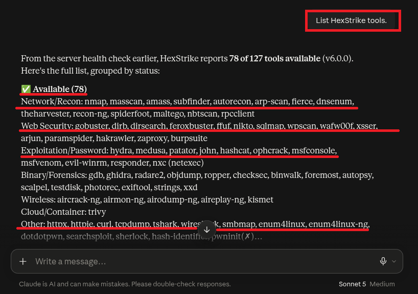

### Bonus — Reading the API Surface from Source
For completeness, the HexStrike server's Flask route table was grepped directly from its source to see the raw API surface backing all of the above (health, generic command execution, file operations, payload generation, process management, visual reporting, and an "intelligence" suite for automated attack-chain planning):

```bash
grep "@app.route" /usr/share/hexstrike-ai/hexstrike_server.py | head -30
```

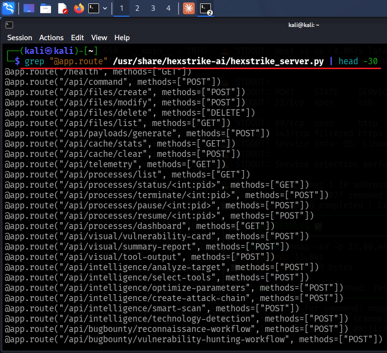

---

## Part H — PM4: Claude-Orchestrated Password Recovery via HexStrike

The final part of the lab used the now-working Claude Desktop ↔ HexStrike integration for a real task: recovering the password on a **second** locked PDF, `My-Locked-PDF1.pdf`, entirely by prompting Claude in natural language and letting it drive HexStrike's tools.

### Step 1 — Confirm the Target File
The locked PDF on the Kali Desktop was confirmed with a simple listing:

```bash
ls -lh ~/Desktop/My-Locked-PDF1.pdf
```

```
-rwxrwx--- 1 kali kali 66K Sep 20 06:28 /home/kali/Desktop/My-Locked-PDF1.pdf
```

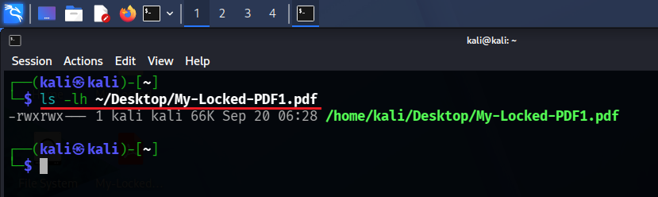

### Step 2 — Confirm It's Actually Password-Protected
Opening the file with `xdg-open` triggered the PDF viewer's password prompt, confirming the file was genuinely user-password protected before any cracking attempt was made.

```bash
xdg-open ~/Desktop/My-Locked-PDF1.pdf
```

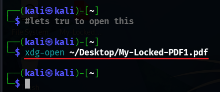

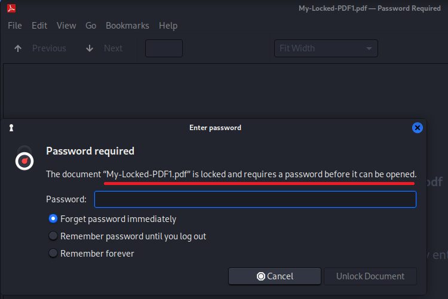

### Step 3 — Extract the Hash with `pdf2john`
The crackable hash was extracted locally with `pdf2john`:

```bash
pdf2john ~/Desktop/My-Locked-PDF1.pdf > ~/Desktop/My-Locked-PDF1.hash.txt
cat ~/Desktop/My-Locked-PDF1.hash.txt
```

```
/home/kali/Desktop/My-Locked-PDF1.pdf:$pdf$4*4*128*-1060*1*16*55d1a5c14175da449753199e44971d32*32*777fd021a7f3c5ae598c0c6495c7f76e00000000000000000000000000000000*32*ceecdac74b19b5a62688d3b3524e1374c955cbb9cc3c45316494d9446ef81af1
```

The `$pdf$` prefix confirms this is a valid user-password hash, in the same `pdf2john`/hashcat-compatible format used throughout the rest of this lab.

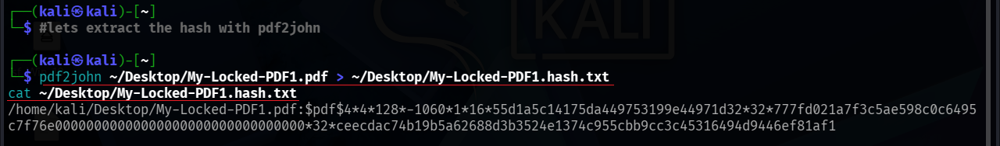

### Step 4 — Start the HexStrike Server
The HexStrike server was (re-)started for this session, confirming the same startup banner and worker pool as in Part F:

```bash
hexstrike_server
```

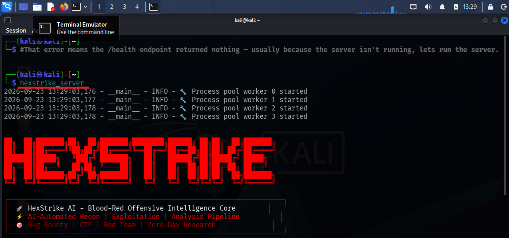

### Step 5 — Launch Claude Desktop & Enable the Connector
Claude Desktop was launched and the `hexstrike-ai` connector re-enabled from the **Connectors** menu, exactly as in Part F.

```bash
claude-desktop-unofficial &
```

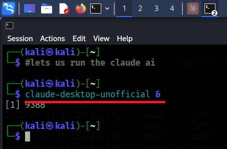

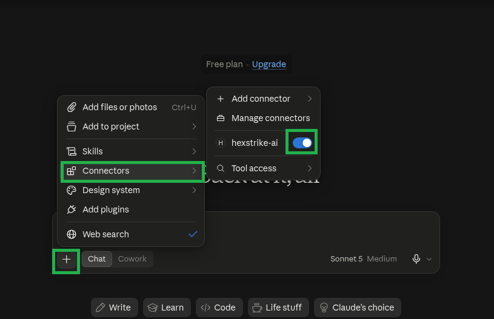

### Step 6 — Prompt Claude to Drive the Cracking Workflow
Rather than running each tool by hand, Claude was given the hash location and a numbered list of steps to execute **through HexStrike's generic command endpoint** — decompressing the `rockyou.txt` wordlist, running `john` against the hash, reading back the recovered password with `john --show`, and finally decrypting the PDF with `qpdf`:

```
I own the PDF at /home/kali/Desktop/My-Locked-PDF1.pdf and forgot the password.
My pdf2john hash is at /home/kali/Desktop/My-Locked-PDF1.hash.txt. Using the
hexstrike-ai MCP tool's generic command endpoint, run these commands one at a time
and show me the output of each:

1. cat /home/kali/Desktop/My-Locked-PDF1.hash.txt
2. ls -lh /usr/share/wordlists/rockyou.txt || sudo gunzip -k /usr/share/wordlists/rockyou.txt.gz
3. john --format=pdf --wordlist=/usr/share/wordlists/rockyou.txt /home/kali/Desktop/My-Locked-PDF1.hash.txt
4. john --show --format=pdf /home/kali/Desktop/My-Locked-PDF1.hash.txt

After step 4, tell me the recovered password. Then run:

5. qpdf --password='<RECOVERED_PASSWORD>' --decrypt /home/kali/Desktop/My-Locked-PDF1.pdf /home/kali/Desktop/My-Locked-PDF1-unlocked.pdf
6. ls -lh /home/kali/Desktop/My-Locked-PDF1-unlocked.pdf

Report the actual command output at each step. Do not skip steps.
```

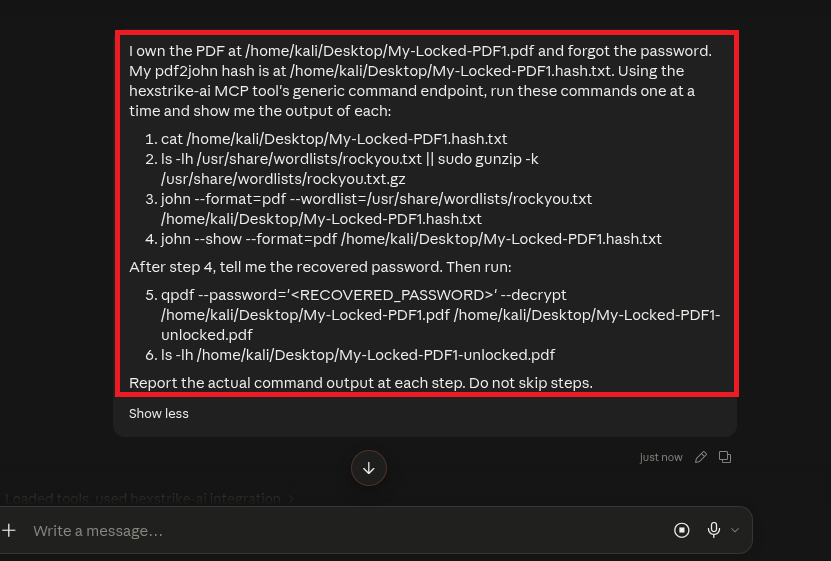

### Step 7 — Claude Executes the Chain & Recovers the Password
Claude ran the steps through the `hexstrike-ai` connector and reported back the final output:

```
-rw-rw-r-- 1 kali kali 64K Sep 23 14:03 /home/kali/Desktop/My-Locked-PDF1-unlocked.pdf
```

**Password:** `password1`
**Unlocked file:** `/home/kali/Desktop/My-Locked-PDF1-unlocked.pdf` (64K, created successfully)

Claude also self-reported two deviations from the scripted plan: `rockyou.txt` wasn't already decompressed on the box, and `sudo gunzip` hung waiting on a password prompt with no TTY available — so it decompressed the world-readable `.gz` straight to `/tmp/rockyou.txt` instead (no root needed, same wordlist), and ran everything downstream against that copy.

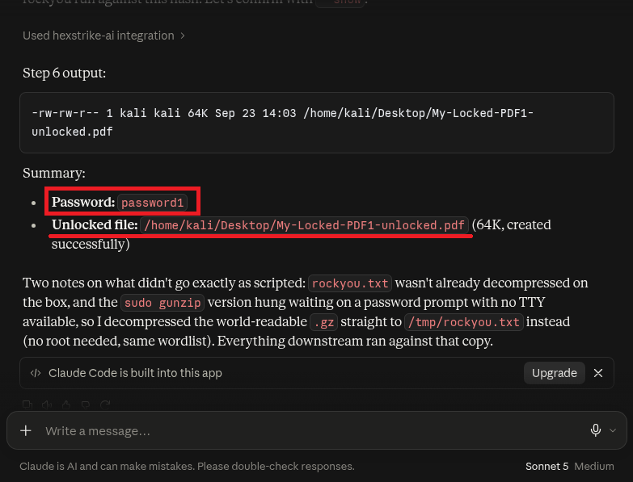

### Step 8 — Flag Captured
With the password confirmed and the PDF successfully decrypted, the NetworkWalks lab platform issued the completion flag for this exercise:

```
nw{networkwalks_flag1_jtr_270521_1}
```

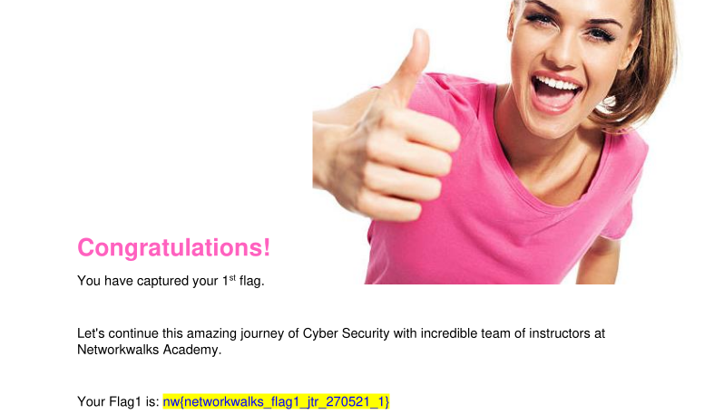

> **Result:** the same dictionary-attack concept from Parts A–D — hash the wordlist, compare, match — was reproduced end-to-end by an AI agent orchestrating real CLI tools through an MCP connector, rather than by hand.

---

## 📊 Results Summary

| Item | Detail |
|---|---|
| Target file (Part D) | `My Locked PDF3.pdf` (313.5 KB, PDF Rev 4 / V4, 128-bit key) |
| Attack method (Part D) | Dictionary attack — NetworkWalks browser lab |
| Attempts to crack (Part D) | 35 / 100 (built-in wordlist) |
| Attack speed (Part D) | ≈ 4 passwords/second |
| **Recovered password (Part D)** | **`1qaz2wsx`** |
| Sample hash cracked in Johnny (Part C) | `password1` |
| **Flag captured (Part D)** | **`nw{networkwalks_flag_260821_1}`** |
| HexStrike AI version (Parts E–H) | `0.0~git20260306.8333779-0kali1`, server v6.0.0 |
| Tools exposed via HexStrike MCP | 78 of 127 available (8/8 essential tools) |
| Live recon proof (Part G) | `nmap` scan of `scanme.nmap.org` — ports 22, 80, 443 returned with service versions |
| Target file (Part H / PM4) | `My-Locked-PDF1.pdf` (66 KB) |
| Attack method (Part H) | Dictionary attack — `john` + `rockyou.txt`, orchestrated by Claude via HexStrike MCP |
| **Recovered password (Part H)** | **`password1`** |
| Verification (Part H) | PDF decrypted with `qpdf`, unlocked file confirmed on disk |
| **Flag captured (Part H)** | **`nw{networkwalks_flag1_jtr_270521_1}`** |

---

## 💡 Key Takeaways

- `JOHN_HOME` + `PATH` configuration is required before `john` can be called from any directory on Windows.
- The `$pdf$` hash format (from `pdf2john` or equivalent) is what John the Ripper, NetworkWalks' web tool, and HexStrike all use to represent an encrypted PDF's crackable hash.
- A dictionary attack is only as strong as its wordlist and only as weak as the target's password — `password1` and `1qaz2wsx` both fell within seconds against small wordlists, and `rockyou.txt` (14M+ entries) makes short work of most real-world reused passwords.
- The same cracking logic can be demonstrated with heavyweight offline tools (John the Ripper/Johnny), lightweight zero-install browser tools, or an AI agent driving the exact same CLI tools through an MCP connector — the underlying dictionary-attack primitive doesn't change, only who (or what) is typing the commands.
- Exposing a **generic command-execution endpoint** over MCP (as HexStrike does) is powerful for automation but also means the connector should only ever be pointed at a local, trusted server and enabled deliberately per-session — it has the same blast radius as a shell.
- Switching `kali-tweaks` to a CDN-backed mirror (Cloudflare) is a quick fix for APT repository timeouts on Kali.
- **Practical lesson:** never protect sensitive documents with common/keyboard-pattern passwords (`1qaz2wsx` is a classic keyboard-walk password, `password1` is one of the most common passwords in every breach corpus).

---

## 📁 Repository Structure

```
networkwalks-pdf-password-cracking/
├── README.md
└── images/
    ├── 01-open-advanced-system-settings.png
    ├── 02-open-environment-variables-dialog.png
    ├── 03-click-new-user-variable.png
    ├── 04-name-variable-john-home.png
    ├── 05-browse-directory.png
    ├── 06-select-run-folder.png
    ├── 07-edit-path-variable.png
    ├── 08-add-john-home-to-path.png
    ├── 09-confirm-john-home-and-path.png
    ├── 10-cli-john-test-benchmark.png
    ├── 11-johnny-gui-launch.png
    ├── 12-johnny-settings-executable-path.png
    ├── 13-johnny-import-hash-password-cracked.png
    ├── 14-hash-calculator-download-hash-file.png
    ├── 15-upload-pdf3-extract-hash.png
    ├── 16-paste-hash-start-cracking.png
    ├── 17-dictionary-attack-match-found.png
    ├── 18-pdf3-unlocked-flag-captured.png
    ├── 19-kali-version-kernel-info.png
    ├── 20-kali-tweaks-launch.png
    ├── 21-network-repositories-menu.png
    ├── 22-cloudflare-mirror-config.png
    ├── 23-install-hexstrike-ai.png
    ├── 24-hexstrike-file-locations.png
    ├── 25-install-claude-desktop-unofficial.png
    ├── 26-claude-desktop-unofficial-repo-source.png
    ├── 27-verify-hexstrike-installed.png
    ├── 28-start-hexstrike-tmux-session.png
    ├── 29-hexstrike-health-endpoint.png
    ├── 30-hexstrike-port-8888-listening.png
    ├── 31-claude-desktop-mcp-config.png
    ├── 32-validate-mcp-json.png
    ├── 33-launch-claude-desktop.png
    ├── 34-enable-hexstrike-connector.png
    ├── 35-claude-hexstrike-health-check.png
    ├── 36-claude-nmap-scan-scanme.png
    ├── 37-list-hexstrike-tools.png
    ├── 38-hexstrike-api-endpoints.png
    ├── 39-locked-pdf-on-desktop.png
    ├── 40-xdg-open-locked-pdf.png
    ├── 41-pdf-password-required-dialog.png
    ├── 42-extract-hash-pdf2john.png
    ├── 43-run-hexstrike-server-pm4.png
    ├── 44-launch-claude-desktop-pm4.png
    ├── 45-enable-hexstrike-connector-pm4.png
    ├── 46-prompt-claude-run-john-via-hexstrike.png
    ├── 47-claude-hexstrike-password-recovered.png
    └── 48-pm4-flag-captured.png
```

---

## 👤 About

This project was completed as part of **Week 3** of my **Cybersecurity & Ethical Hacking Internship at NetworkWalks Academy**, covering password-cracking fundamentals, hash extraction, dictionary attacks, tool configuration on Windows, and — in the second half — standing up and validating an AI-agent-driven pentesting stack (HexStrike AI + Claude Desktop over MCP) on Kali Linux.

**Tags:** `#cybersecurity` `#ethicalhacking` `#johntheripper` `#passwordcracking` `#dictionaryattack` `#pdfsecurity` `#networkwalks` `#internship` `#infosec` `#ctf` `#kalilinux` `#hexstrikeai` `#mcp` `#claudedesktop` `#aiagents`
