# 🔐 Cracking a Password-Protected PDF — John the Ripper, Johnny GUI & NetworkWalks Dictionary Attack Lab

**NetworkWalks Academy Internship — Week 3 Project**


`cybersecurity` `ethical-hacking` `password-cracking` `john-the-ripper` `johnny-gui` `dictionary-attack` `pdf-security` `pentesting` `ctf` `networkwalks` `internship` `infosec` `windows`

---

## 📖 Description

This repository documents a hands-on password-cracking lab completed during **Week 3 of my Cybersecurity & Ethical Hacking internship at NetworkWalks Academy**. The goal was to recover the password of an encrypted PDF file (`My Locked PDF3.pdf`) using a **dictionary attack**, demonstrated through two complementary workflows:

1. **Local / offline tooling** — installing and configuring **John the Ripper** (Jumbo build) on Windows, setting up the `JOHN_HOME` environment variable, verifying the CLI, and using the **Johnny GUI** to import a hash and recover a password.
2. **Browser-based tooling** — using NetworkWalks' own **Hash Calculator** and **Password Cracker (Dictionary Attack Lab)** web tools to extract a `$pdf$` hash from the locked PDF and run a live dictionary attack against it, entirely client-side.

Both approaches implement the exact same underlying idea: hash every word in a wordlist and compare it against the target hash until a match is found. The lab ends with the PDF successfully unlocked and a **capture-the-flag (CTF) flag** confirming completion.

> 📌 All screenshots in `/images` are original captures taken while performing this lab inside a Windows 10 Pro VirtualBox VM.

---

## 📑 Table of Contents

- [Tools & Environment](#-tools--environment)
- [Part A — Configuring John the Ripper (`JOHN_HOME`)](#part-a--configuring-john-the-ripper-john_home-environment-variable)
- [Part B — Verifying John the Ripper via CLI](#part-b--verifying-john-the-ripper-from-the-command-line)
- [Part C — Cracking a Hash with Johnny GUI](#part-c--extracting--cracking-a-hash-with-johnny-gui)
- [Part D — Cracking "Locked PDF 3" with NetworkWalks Lab Tools](#part-d--password-cracking-of-locked-pdf-3-using-the-networkwalks-dictionary-attack-lab)
- [Results Summary](#-results-summary)
- [Key Takeaways](#-key-takeaways)
- [Repository Structure](#-repository-structure)
- [About](#-about)

---

## 🛠 Tools & Environment

| Item | Detail |
|---|---|
| **OS** | Windows 10 Pro (64-bit), inside a VirtualBox VM (`vboxuser`) |
| **John the Ripper** | v1.9.0-jumbo-1 (Win64 build), extracted to Desktop |
| **Johnny** | GUI front-end for John the Ripper |
| **NetworkWalks Hash Calculator** | Web tool — generates MD5/SHA-1/SHA-256/SHA-384/SHA-512 and extracts crackable hashes from password-protected PDFs (parsed 100% locally in-browser) |
| **NetworkWalks Password Cracker** | Web tool — dictionary attack lab that hashes every wordlist entry and matches it against a supplied `$PDF$` hash |
| **Target file** | `My Locked PDF3.pdf` (313.5 KB, Revision R4, Version V4, 128-bit key) |
| **Attack type** | Dictionary attack |

---

## Part A — Configuring John the Ripper (`JOHN_HOME`) Environment Variable

Before `john` can be run from any command prompt, Windows needs to know where the tool lives. This is done with a `JOHN_HOME` user environment variable added to `PATH`.

### Step 1 — Open Advanced System Settings
`This PC → Properties → Advanced system settings`

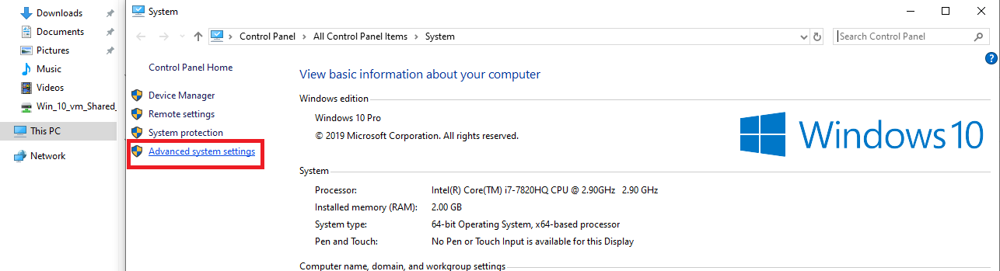

### Step 2 — Open Environment Variables
Under the **Advanced** tab of System Properties, click **Environment Variables…**

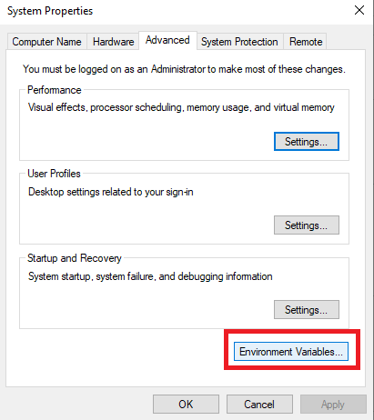

### Step 3 — Create a New User Variable
Under *User variables for vboxuser*, click **New…**

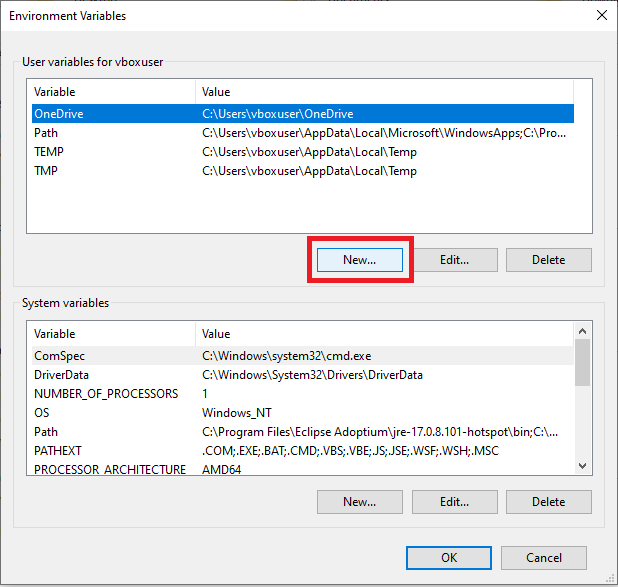

### Step 4 — Name the Variable
Set **Variable name** to `JOHN_HOME`.

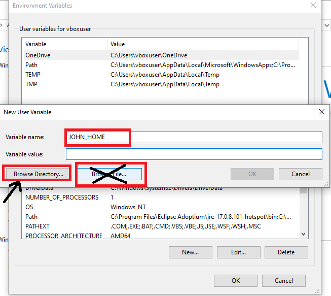

### Step 5 — Browse for the Directory
Use **Browse Directory…** (not *Browse File…*) since `JOHN_HOME` must point to a folder.

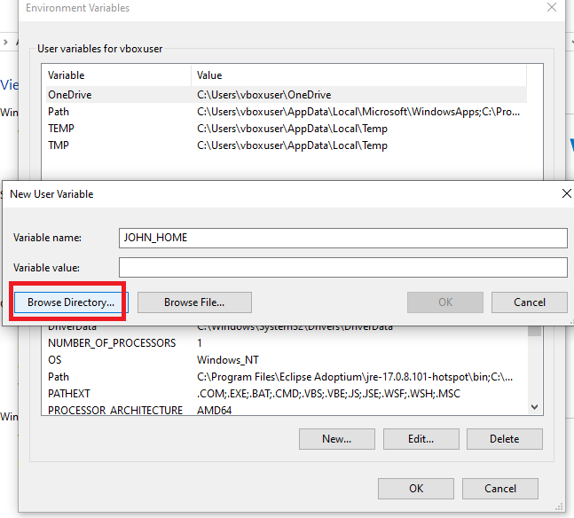

### Step 6 — Select the `run` Folder
Inside the extracted `john-1.9.0-jumbo-1-win64` package, select the **`run`** sub-folder (contains `john.exe` and all supporting files), then click **OK**.

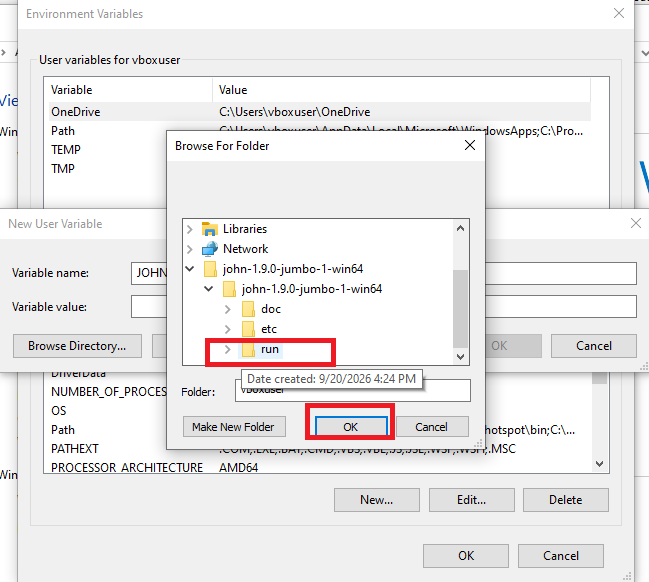

### Step 7 — Edit the `Path` Variable
Back in Environment Variables, select the existing **Path** variable and click **Edit…**

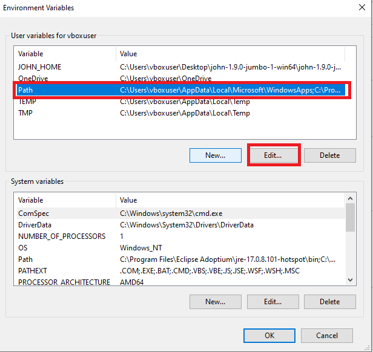

### Step 8 — Add `%JOHN_HOME%` to `Path`
Click **New**, add `%JOHN_HOME%` as a new entry, then **OK** to save.

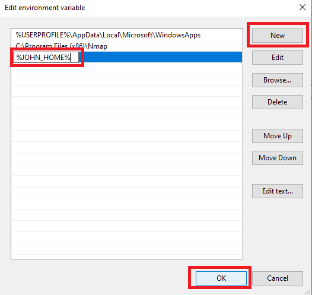

### ✅ Confirming the Setup
`JOHN_HOME` now appears in the User variables list, and `Path` includes the `%JOHN_HOME%` reference — `john` can now be invoked from any directory.


---

## Part B — Verifying John the Ripper from the Command Line

To confirm the setup worked, John the Ripper's built-in self-test/benchmark mode was run from Command Prompt:

```bat
C:\Users\vboxuser>cd C:\Users\vboxuser\Desktop\john-1.9.0-jumbo-1-win64\john-1.9.0-jumbo-1-win64\run
C:\Users\vboxuser\...\run>john --test
```

The benchmark ran successfully across multiple hash formats (`descrypt`, `bsdicrypt`, `md5crypt`, `md5crypt-long`, `bcrypt`, `scrypt`, `LM`, …), reporting cracking speed (candidates/second) for each — confirming the binaries, dependencies, and `JOHN_HOME`/`PATH` config all work.

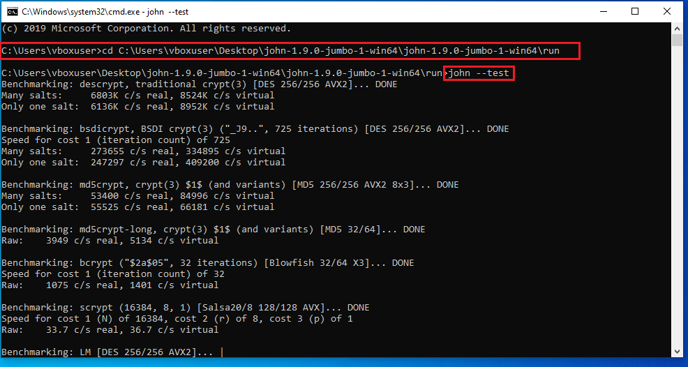

---

## Part C — Extracting & Cracking a Hash with Johnny GUI

### Launching Johnny
Johnny — the graphical front-end for John the Ripper — opens with an empty **Passwords** panel until a hash file is loaded.

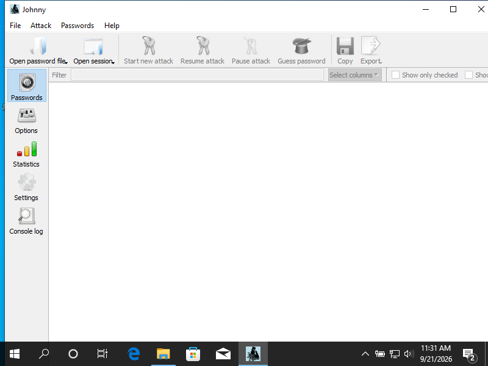

### Pointing Johnny to `john.exe`
Under **Settings**, the path to `run\john.exe` was configured. Johnny auto-detected: `John the Ripper 1.9.0-jumbo-1 [cygwin 64-bit x86_64 AVX2 AC]`.

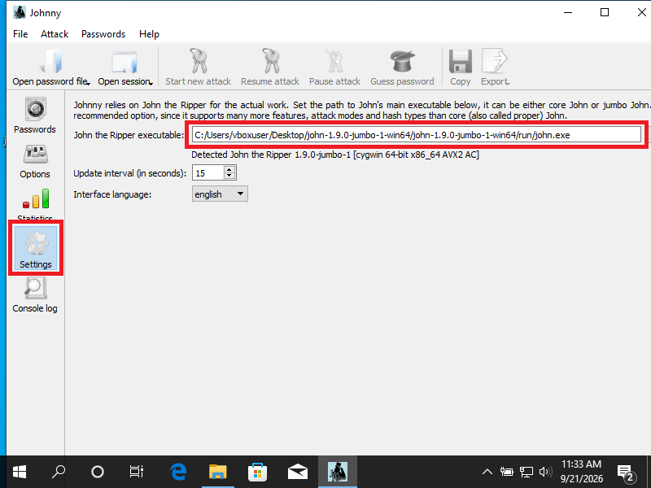

### Importing the Hash & Cracking
A downloaded `$pdf$` hash file was opened via **Open password file**. Johnny listed one entry (Format: `PDF`) and, after the attack ran, displayed the recovered plaintext password directly in the **Password** column: **`password1`**.

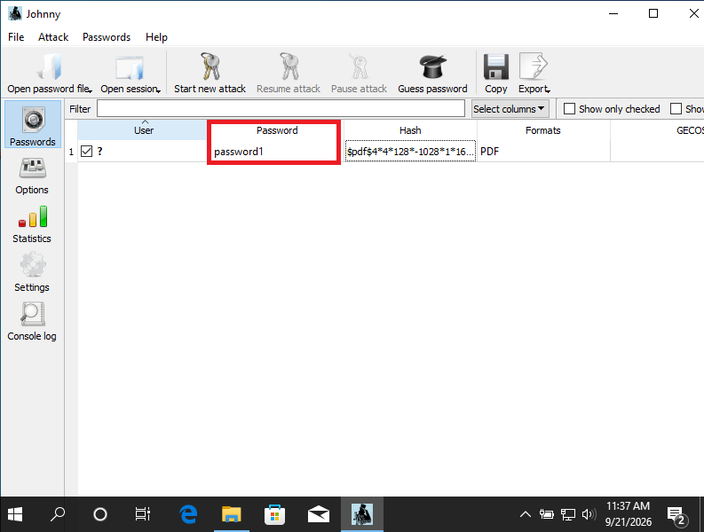

> **Result:** the John the Ripper → Johnny GUI tool chain was confirmed fully functional end-to-end.

---

## Part D — Password Cracking of "Locked PDF 3" Using the NetworkWalks Dictionary Attack Lab

This is the main event: cracking the actual target file, **`My Locked PDF3.pdf`**, using NetworkWalks' browser-based lab tools (same $pdf$ hash / dictionary-matching logic as John the Ripper).

### Step 1 — Upload the PDF & Extract Its Hash
On the **Hash Calculator** tool (PDF tab), `My Locked PDF3.pdf` (313.5 KB) was uploaded and parsed **entirely client-side**. The tool detected encryption and extracted a crackable, `pdf2john`/hashcat-compatible hash:

```
$pdf$4*4*128*-1028*1*16*34eb542eff4e1b0b32d25ce15a9a7281*32*b77872bfc9a24fb2f845066283a8fc1b0021446990b9e4114071a4d9104984c1*32*e7572256e4b552cd57988f5134214b91920d94d7a6bf550ea94a2995c7f2ab02
```
Encryption metadata: **Revision R4, Version V4, Key length 128-bit**.

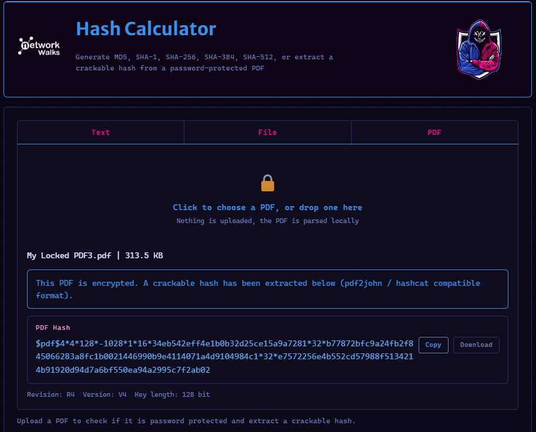

The hash can also be saved directly to disk via the **Download** button (the same file that was used with Johnny in Part C):

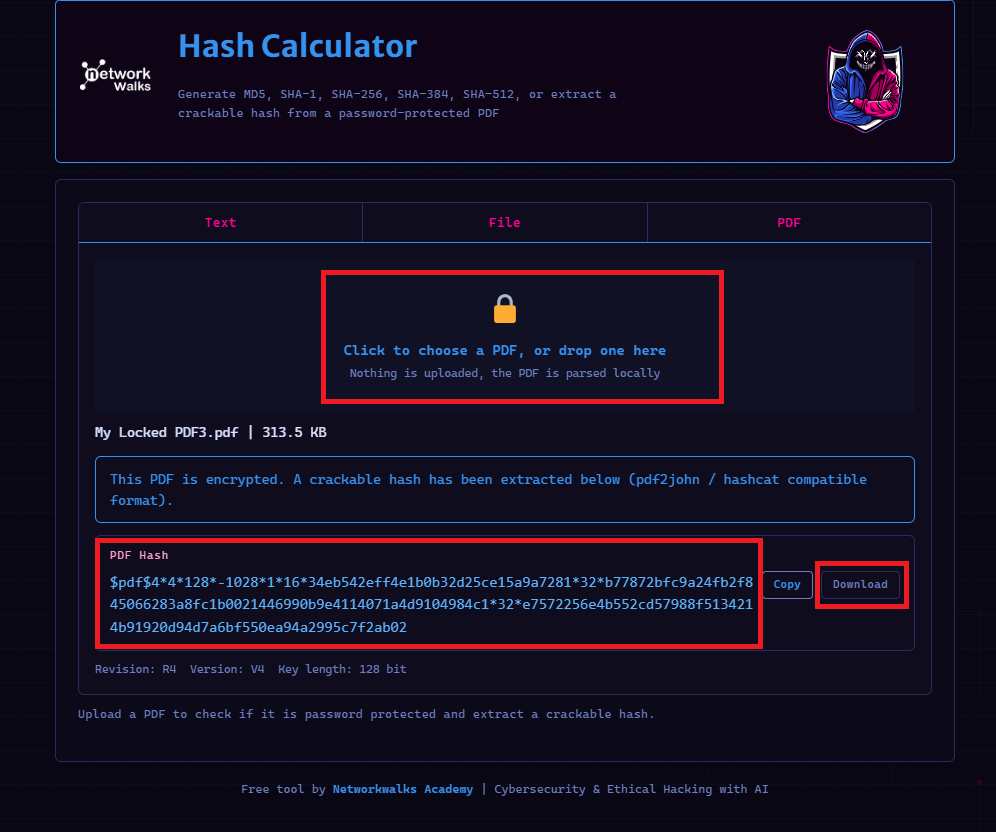

### Step 2 — Paste the Hash & Start the Attack
On the **Password Cracker through Dictionary Attacks** tool, the copied hash was pasted into the `PDF HASH ($PDF$...)` field. The built-in **100-password wordlist** was left active, then **START CRACKING** was clicked.

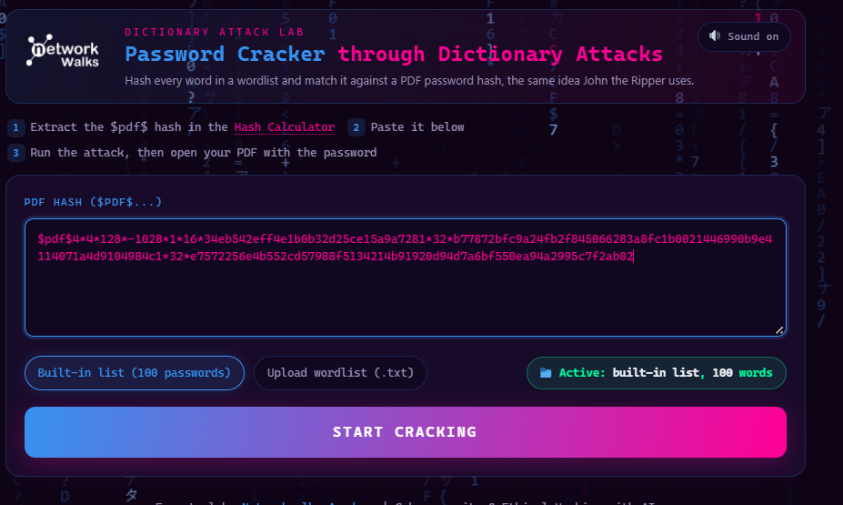

### Step 3 — Dictionary Attack in Progress → Match Found
The tool hashed each wordlist candidate live (`login`, `starwars`, `121212`, `bailey`, `freedom`, `shadow`, `master`, `666666`, `superman` — all rejected) at **≈4 passwords/second**. At **35/100 (35%)** attempts, it hit:

```
[+] MATCH 1qaz2wsx ✓
PASSWORD CRACKED SUCCESSFULLY
```

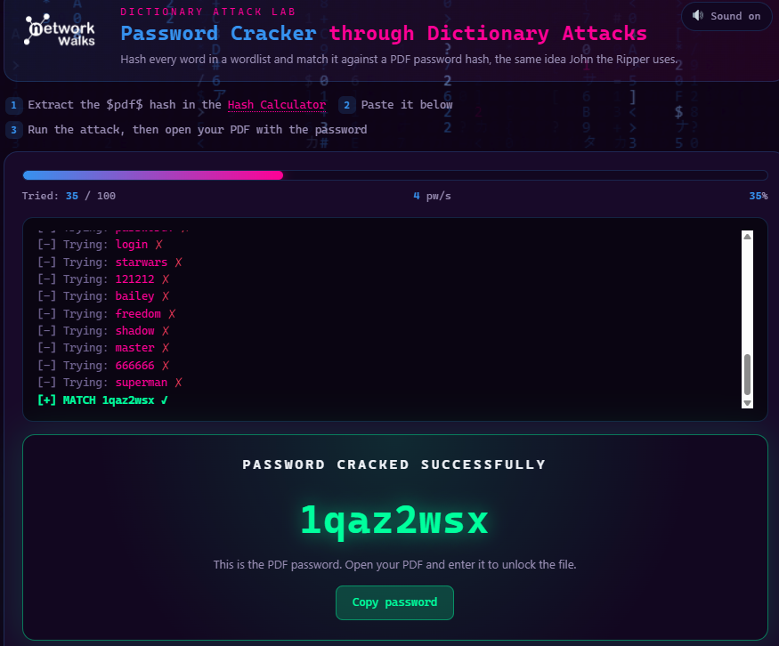

### Step 4 — Unlocking the PDF & Capturing the Flag
The recovered password **`1qaz2wsx`** was used to open `My Locked PDF3.pdf` — it unlocked successfully, and the NetworkWalks lab platform issued the completion flag:

```
nw{networkwalks_flag_260821_1}
```

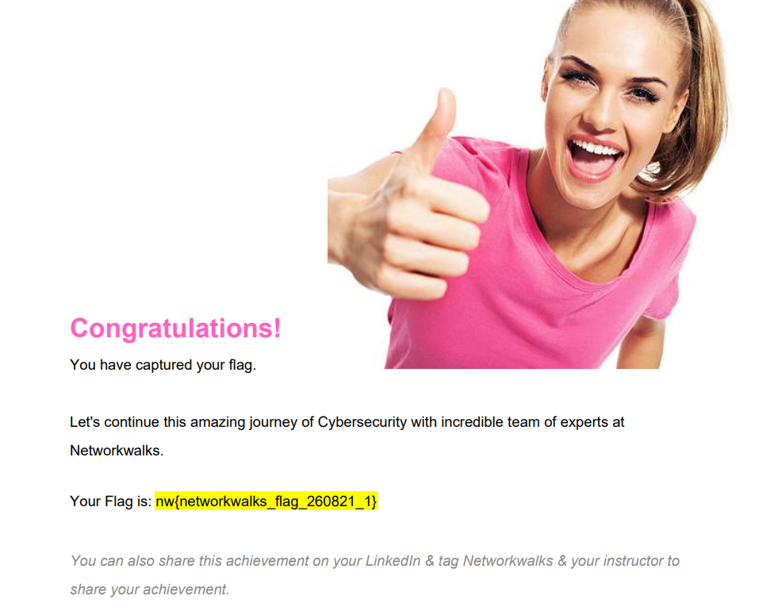

---

## 📊 Results Summary

| Item | Detail |
|---|---|
| Target file | `My Locked PDF3.pdf` (313.5 KB, PDF Rev 4 / V4, 128-bit key) |
| Attack method | Dictionary attack |
| Attempts to crack | 35 / 100 (built-in wordlist) |
| Attack speed | ≈ 4 passwords/second |
| **Recovered password** | **`1qaz2wsx`** |
| Sample hash cracked in Johnny (Part C) | `password1` |
| Verification | PDF opened successfully with recovered password |
| **Flag captured** | **`nw{networkwalks_flag_260821_1}`** |

---

## 💡 Key Takeaways

- `JOHN_HOME` + `PATH` configuration is required before `john` can be called from any directory on Windows.
- The `$pdf$` hash format (from `pdf2john` or equivalent) is what both John the Ripper and NetworkWalks' web tool use to represent an encrypted PDF's crackable hash.
- A dictionary attack is only as strong as its wordlist and only as weak as the target's password — both `password1` and `1qaz2wsx` fell within seconds against a **100-word** list.
- The same cracking logic can be demonstrated with heavyweight offline tools (John the Ripper/Johnny) or lightweight, zero-install browser tools — useful for quick labs and teaching.
- **Practical lesson:** never protect sensitive documents with common/keyboard-pattern passwords (`1qaz2wsx` is a classic keyboard-walk password).

---

## 📁 Repository Structure

```
networkwalks-pdf-password-cracking/
├── README.md
└── images/
    ├── 01-open-advanced-system-settings.png
    ├── 02-open-environment-variables-dialog.png
    ├── 03-click-new-user-variable.png
    ├── 04-name-variable-john-home.png
    ├── 05-browse-directory.png
    ├── 06-select-run-folder.png
    ├── 07-edit-path-variable.png
    ├── 08-add-john-home-to-path.png
    ├── 09-confirm-john-home-and-path.png
    ├── 10-cli-john-test-benchmark.png
    ├── 11-johnny-gui-launch.png
    ├── 12-johnny-settings-executable-path.png
    ├── 13-johnny-import-hash-password-cracked.png
    ├── 14-hash-calculator-download-hash-file.png
    ├── 15-upload-pdf3-extract-hash.png
    ├── 16-paste-hash-start-cracking.png
    ├── 17-dictionary-attack-match-found.png
    └── 18-pdf3-unlocked-flag-captured.png
```

---

## 👤 About

This project was completed as part of **Week 3** of my **Cybersecurity & Ethical Hacking Internship at NetworkWalks Academy**, focused on password cracking fundamentals, hash extraction, dictionary attacks, and tool configuration on Windows.

**Tags:** `#cybersecurity` `#ethicalhacking` `#johntheripper` `#passwordcracking` `#dictionaryattack` `#pdfsecurity` `#networkwalks` `#internship` `#infosec` `#ctf`
